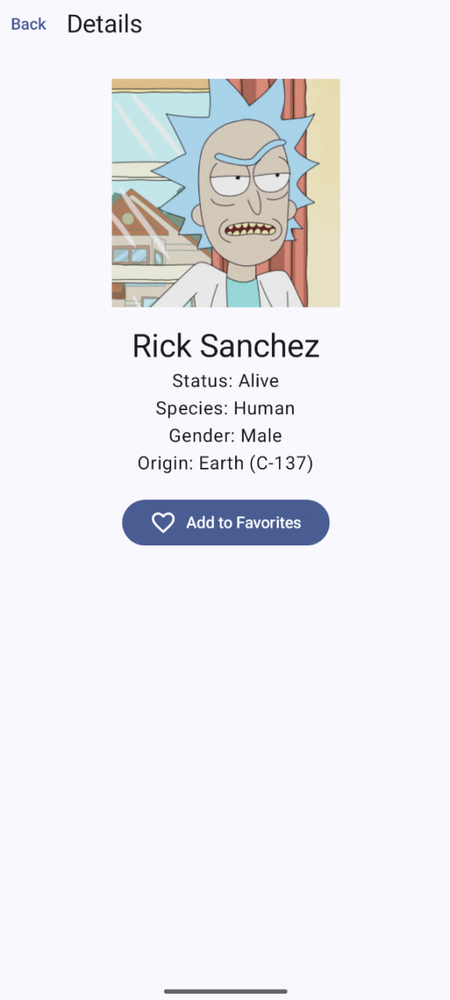

# Домашнее задание 3: Приложение на базе открытого API

### ФИО: Полатинский Артем
### Группа: ПИКД(7)

---

## Выбранный API: Rick and Morty API
Описание: Для проекта был выбран Rick and Morty API. Это RESTful API, которое предоставляет информацию о персонажах, локациях и эпизодах мультсериала. В приложении реализован функционал получения списка всех героев, поиск по имени и детальный просмотр информации о каждом персонаже.

## Как запустить
1. Склонируйте данный репозиторий.
2. Откройте проект в Android Studio (рекомендуется версия Ladybug или новее).
3. Убедитесь, что в системе установлен Android SDK 36 (приложение использует compileSdk 36).
4. Нажмите кнопку Run. API является открытым, дополнительные API-ключи не требуются.

## Реализованный функционал

### Обязательные требования:
- Навигация: Реализовано 3 экрана: List (Список персонажей), Detail (Детальная информация), Favorites (Избранное).
- Архитектура:
    - Использование UiState (Loading, Success, Error, Empty) для обработки состояний экрана.
    - ViewModel с использованием viewModelScope.
    - Слой Repository для изоляции сетевой логики.
- Coroutines + Retrofit: Все сетевые вызовы реализованы через suspend функции.
- UI состояния: Реализована корректная обработка загрузки, ошибок (с кнопкой Retry) и пустых результатов.
- Избранное: Локальное хранение выбранных персонажей в памяти ViewModel (сохраняется при повороте экрана).

### Бонусы:
- Jetpack Compose + Material3: Современный UI.
- Navigation Compose: Маршрутизация через NavHost.
- Debounce поиска: Реализована задержка в 500мс перед выполнением сетевого запроса при вводе текста (через Job + delay).
- Экран Favourites: Реализован как отдельный route в навигации.
- Coil: Использование библиотеки для асинхронной загрузки и кэширования изображений.
- OkHttp Logging Interceptor: Настроено логирование запросов в Logcat для удобства отладки.

## Скриншоты
В данной секции представлены скриншоты работы приложения (размещены в папке screenshots):

| Состояние | Скриншот |
| :--- | :--- |
| Список персонажей (List) |  |
| Поиск (Search) |  |
| Детали персонажа (Detail) |  |
| Избранное (Favorites) |  |

---
Проект выполнен в рамках учебного курса по разработке мобильных приложений.
